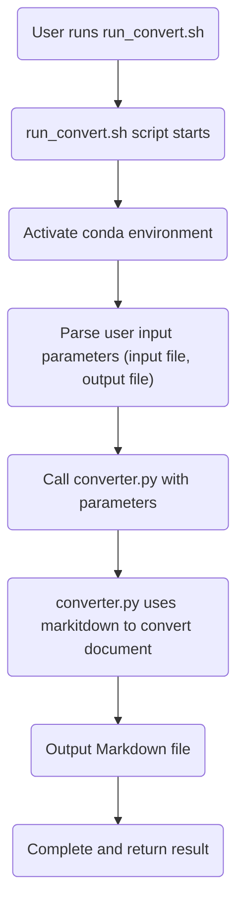

# Document to Markdown Converter

## Introduction

This project is based on the [markitdown](https://github.com/microsoft/markitdown/) library, implementing functionality to convert Office documents (such as .docx) to Markdown files.
The project provides a set of Python scripts and corresponding Shell scripts for convenient local execution of the conversion process.

## Directory Structure

```
project_root/
├─ README.md
├─ requirements.txt
├─ install_env.sh
├─ python/
│  ├─ converter.py
│  └─ __init__.py
└─ scripts/
   ├─ run_convert.sh
   └─ activate_env.sh
```

- `install_env.sh`: Script to create and install required environment and dependencies through conda.
- `requirements.txt`: Python dependency list, including third-party libraries like markitdown.
- `python/converter.py`: Core conversion logic script, using markitdown to convert Office documents to Markdown.
- `scripts/run_convert.sh`: Shell script for activating the environment and calling `converter.py`.
- `scripts/activate_env.sh`: Helper script for activating the conda virtual environment.

## Environment Setup

1. Ensure [conda](https://docs.conda.io/en/latest/) is installed.
2. Run in the project root directory:
   ```bash
   chmod +x install_env.sh
   ./install_env.sh
   ```
   The script will create and activate the conda environment, then install dependencies from `requirements.txt`.

## Usage

1. Prepare input file (e.g., `input.docx`).
2. Execute script:
   ```bash
   ./scripts/run_convert.sh input.docx output.md
   ```
   - The script will automatically activate the corresponding conda environment and call `converter.py` to complete the conversion.
   - After execution, `output.md` will be the conversion result.

## Flow Chart



## Common Issues

- **Q:** What if conda is not installed?
- **A:** Please refer to the [conda official documentation](https://docs.conda.io/en/latest/) to install conda before running `install_env.sh`.

- **Q:** How to add new dependencies?
- **A:** Modify `requirements.txt` and re-run `install_env.sh` to update the environment.

## References

- [markitdown project repository](https://github.com/microsoft/markitdown/)
